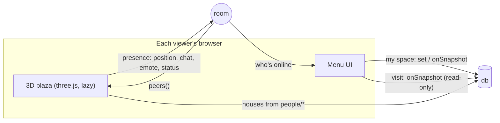

# Studio Menu: how spaces and the plaza work

Studio Menu started as one person's bookmark launcher. It now gives everyone who opens it their own
**space** (a full menu), lets them **visit** each other's spaces, and connects everyone online in a
**3D plaza** with animal avatars. This page explains what each part runs on, what the limits are,
and what would change if it outgrew the claude.ai artifact platform.

## The platform pieces

The page is a claude.ai artifact. The runtime gives it capabilities through `claude.use(name)`.
Four of them carry the social features:

| Need | Capability | What it gives us |
|---|---|---|
| Who is this? | `user` (scope `profile`) | A stable opaque id per person, names/avatars resolved at render time, `isOwner`, `can("data.write")` |
| Durable shared data | `db` + access rules | JSON documents, live `onSnapshot`, per-path read/write levels, `{self}` paths only their owner can write |
| Real-time "who's here" | `room` | Presence: one small object per open page (≤4 KiB) that everyone sees live and that clears when they leave |
| Files | `assets`, `downloads` | Uploaded icons/backdrops (editors only); saving the plaza photo |

Nothing needs a server of our own.

## Data model

| Path | Written by | Read by | Holds |
|---|---|---|---|
| `menu/main` | owner only | everyone | The owner's space (same shape as before spaces existed) |
| `hub/info` | owner only | everyone | `{ ownerId }`, so others know which id `menu/main` belongs to |
| `spaces/<id>` | that person | everyone | Their space: pages, channels, workflows, audio, theme, backdrop |
| `people/<id>` | that person | everyone | `{ avatar, card: { title, blurb, listed, hue, tiles } }` |
| `social/<id>` | that person | everyone | Stamps they left: `{ to: [spaceIds], stamps: { spaceId: { s, note, at } } }` |
| `data/users/<id>/private` | that person | that person only | `{ notes }`: channel notes, never shared |

The rules live in `src/capabilities.json`. The pattern `{ path: "spaces", write: "owner" }` +
`{ path: "spaces/{self}", write: "interact" }` means each person writes only their own document and
the artifact owner can moderate. Stamps are stored under the **visitor's** id and found by the space's
owner with `where("to", "array-contains", myId)`, so nobody writes into anyone else's documents.

Presence (never stored): `{ w: "menu"|"plaza"|"visit", p: [x, z, rot], m, av, st, now, say, e }`.
Chat and emotes ride presence instead of `room` events on purpose: presence can be set by every
admitted viewer, while event topics need Contributor or higher. So people with view-only access can
still walk around and chat.

## Who can do what

This follows the claude.ai share menu:

- **Owner**: everything, including moderating any space.
- **Contributor** (in the owner's organization, or an org member arriving by link): gets their own
  space, card, avatar and stamps.
- **Viewer / Commenter / people from outside the organization**: visit spaces and use the plaza
  (walk, chat, emote). Their avatar lives on their device. They can't save a space.
- **Signed out**: no data at all.

A page that declares `db` is organization-internal. So "other users" here means colleagues in the
owner's claude.ai organization plus invited guests; it is not a public social network.

## The 3D plaza

- three.js r186 is imported from jsDelivr only when someone opens the plaza. The menu stays light.
- Avatars are built from primitives with toon shading (`24-avatar.js`): 8 species, fur and scrub
  colours, hats (nurse cap, surgical cap, head mirror, flower, bow), extras (stethoscope, bandage,
  glasses, clipboard), eyes, nickname. The config is about 100 bytes, so it travels in presence.
- Movement is local and instant. The position is sent at most about 9 times a second, and only when
  it changes. Everyone else interpolates toward the last position they heard.
- Houses: every listed space gets a house on two rings around the fountain (23 slots). The owner's is
  north; the Avatar Clinic sits south. Walking to a door visits that space and offers "Back to plaza".
- Photo booth: renders a polaroid of the current view and saves it through `downloads`.

## Limits of the artifact platform

| Limit | Value | Effect |
|---|---|---|
| Documents per artifact | 5,000 | About 1,500 active people (spaces + people + social each) |
| Document size | 256 KiB | A space with many data-URL icons can hit this; editors' icons go to `assets` instead |
| Presence object | 4 KiB | Plenty for position + avatar + short chat |
| Room size | ~256 peers fully tracked | Beyond that, peer lists are partial |
| Queries | scan the collection | Fine for hundreds to low thousands of people |
| Who can join | owner's org + invited guests | No public sign-up |

## If it outgrows the artifact

Moving to a public, open-signup site would mean replacing each capability with a real service. The
code already reaches them through a few functions (`connectDb`, `connectRoom`, `setPresence`,
`visitSpace`, `saveMyCard`), so a backend adapter could replace them without rewriting the UI.

| Artifact capability | Standalone replacement |
|---|---|
| `user` | Auth provider (Supabase Auth, Clerk, Auth0) with public profiles |
| `db` + rules | Postgres with row-level security (Supabase), or Firestore with security rules |
| `room` presence | A real-time server: Cloudflare Durable Objects / PartyKit, Colyseus, or Supabase Realtime. Add server-side speed checks so positions can't be faked |
| `assets` | Object storage (Cloudflare R2, S3) with image resizing |
| Hosting | Static hosting (Cloudflare Pages, Vercel); same build output |
| New needs | Moderation (report, block, word filter), rate limits, account deletion, privacy policy, and for a minors-heavy audience, COPPA/age gating |

A public "Mii plaza" would also want interest-based **instances** (rooms of ~50 people),
server-authoritative movement, and voice or proximity chat. Those are straightforward on Durable
Objects or Colyseus and don't fit inside an artifact.

## Artifacts

- Live (pinned): https://claude.ai/artifact/PHzcJUDEgTroYfg1cyVQbY. Spaces + plaza release published as version 12 (2026-09-27).
- Preview (private until shared): https://claude.ai/artifact/AqsumdzGWvdxzuPWFjfavi. Seeded with a copy of the live
  menu (channels and 12 icons; notes left out). Publish it with `<title>Studio Menu Preview</title>` so the two
  artifacts are easy to tell apart.
